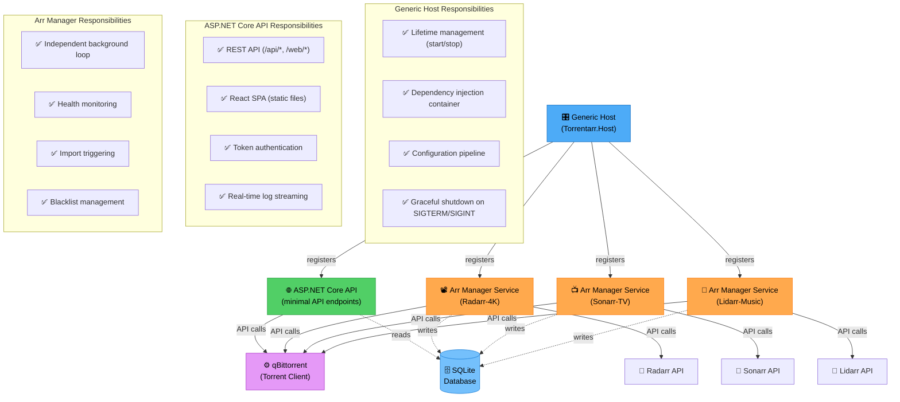
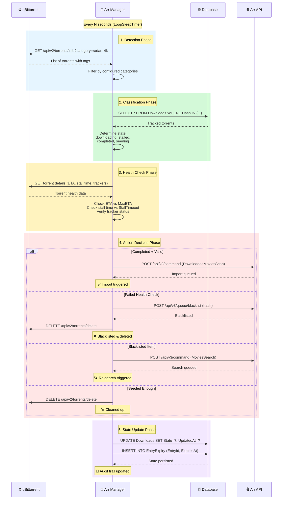
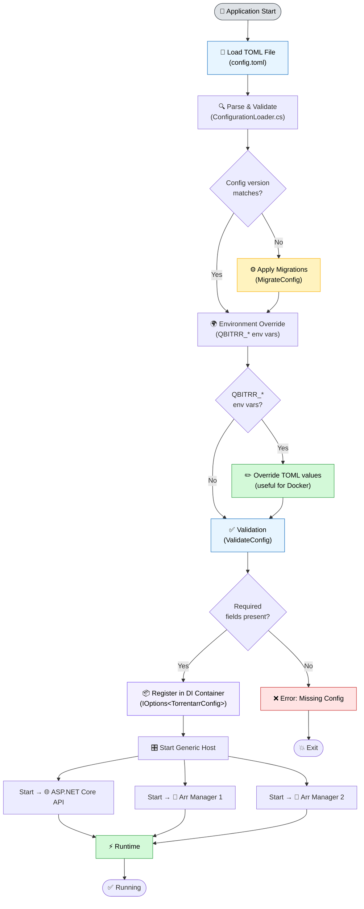
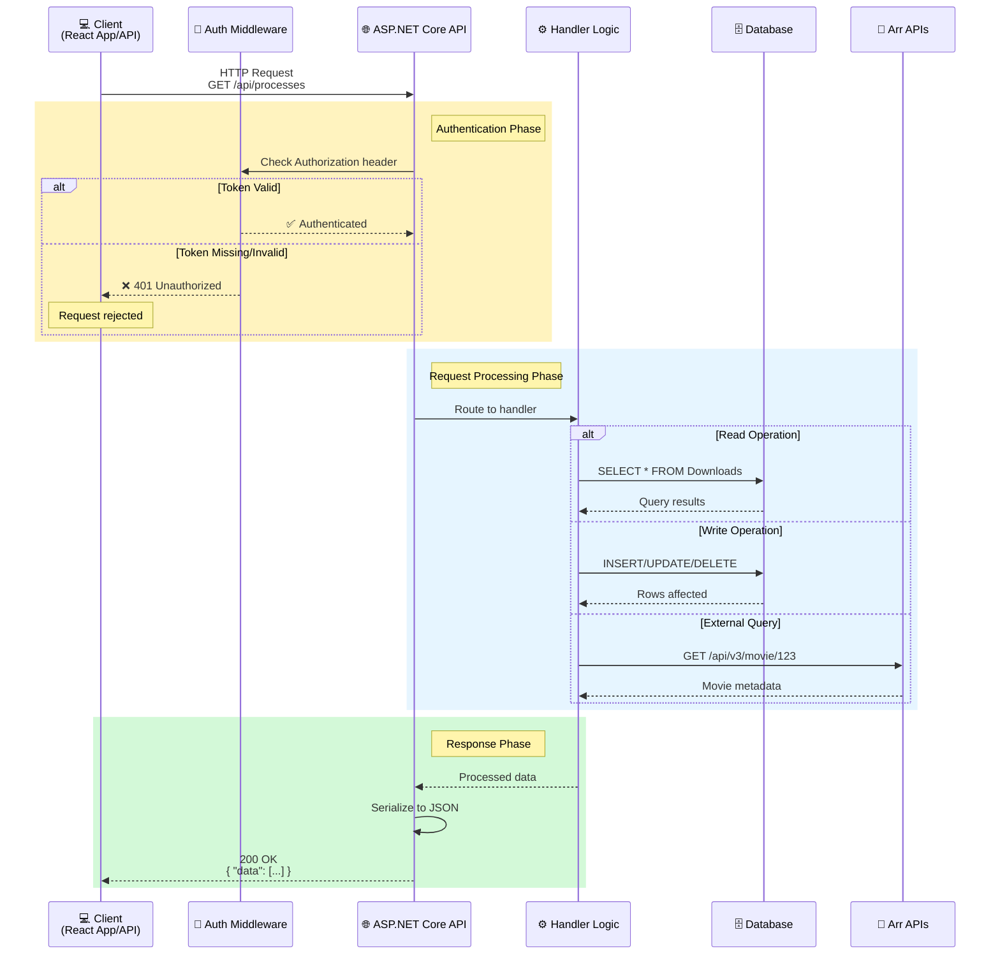
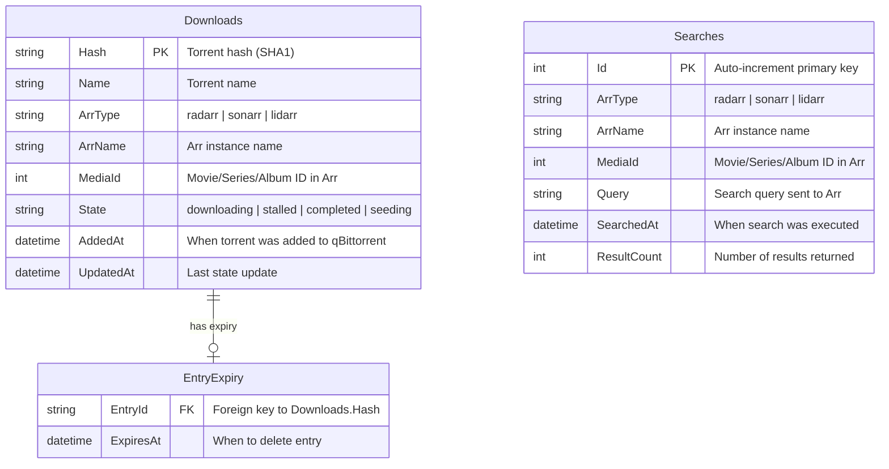
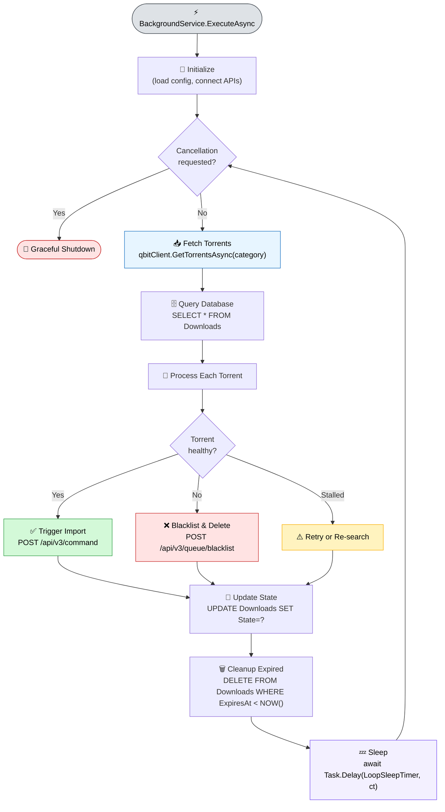

# Architecture

Detailed overview of Torrentarr's system architecture and design patterns.

## System Design

Torrentarr uses ASP.NET Core Generic Host with hosted background services, designed for reliability, scalability, and isolation:



**Key Architecture Principles:**

- **Service Isolation**: Each Arr instance runs as an independent `BackgroundService` — one failure doesn't affect others
- **Fault Tolerance**: The host monitors and restarts failed services via `CancellationToken` and retry policies
- **Simplicity**: No complex IPC — coordination via SQLite and external APIs
- **Dependency Injection**: All components are registered in the DI container for testability

### Core Components

#### Generic Host
**Project:** `Torrentarr.Host`

The entry point — `Program.cs` — configures and starts the ASP.NET Core Generic Host:

- Reads and validates configuration (TOML)
- Registers all services in the DI container
- Starts the ASP.NET Core HTTP server
- Starts all `IHostedService` instances
- Handles SIGTERM/SIGINT for graceful shutdown

#### ASP.NET Core API
**Project:** `Torrentarr.Host` — minimal API endpoints in `Program.cs`

Responsibilities:

- Serves REST API on `/api/*` (token-protected) and `/web/*` (public) routes
- Hosts React SPA from `Torrentarr.Host/static/` via static file middleware
- Provides token-based authentication middleware
- Serves log files and process status to the WebUI

#### Arr Manager Services
**Project:** `Torrentarr.Core` — `ArrManagerBase` and subclasses

Each configured Arr instance (Radarr/Sonarr/Lidarr) runs as an `IHostedService`:

- Independent background loop checking qBittorrent every N seconds
- Queries Arr API for media information
- Performs health checks on torrents
- Triggers imports when torrents complete
- Manages blacklisting and re-searching
- Tracks state in SQLite database

### Background Services

#### Auto-Update Service

- Checks GitHub releases for new versions on a schedule
- Downloads and validates release packages
- Triggers application restart when an update is available

#### Configuration Watcher

- Monitors `config.toml` for file-system changes
- Signals running services to reload configuration
- Triggers a `RestartLoopException`-equivalent via `CancellationToken`

## Data Flow

### Torrent Processing Pipeline



**Pipeline Stages:**

1. **Detection** — Poll qBittorrent for torrents matching configured categories/tags
2. **Classification** — Query database to determine tracking state and history
3. **Health Check** — Evaluate torrent health against configured thresholds
4. **Action Decision** — Choose appropriate action (import/blacklist/re-search/cleanup)
5. **State Update** — Persist state changes and actions to database for audit trail

### Configuration Flow



**Configuration Precedence (highest to lowest):**

1. **Environment Variables** (`QBITRR_*`) — Highest priority
2. **TOML File** (`config.toml`) — Standard configuration
3. **Defaults** (in `ConfigurationLoader.cs`) — Fallback values

**Key Files:**

- `Torrentarr.Core/Configuration/ConfigurationLoader.cs` — TOML parsing, validation, migrations
- `Torrentarr.Host/Program.cs` — DI registration, host startup

### API Request Flow



**API Endpoints:**

- `/api/processes` — List all Arr manager services and their states
- `/api/logs` — Read log files
- `/api/config` — Read/update configuration
- `/web/status` — Public status endpoint
- `/web/qbit/categories` — qBittorrent category information

**Authentication:**

All `/api/*` endpoints require `Authorization: Bearer` header matching `WebUI.Token` from config.toml.

## Component Architecture

### Hosted Services Model

Torrentarr uses .NET's `IHostedService` / `BackgroundService` pattern:

```
┌─────────────────────────────────────────────────────────┐
│              Generic Host (Program.cs)                   │
│  - Configuration management                              │
│  - Dependency injection container                        │
│  - Service lifecycle orchestration                       │
│  - Signal handling (SIGTERM, SIGINT)                     │
└──────────────────┬──────────────────────────────────────┘
                   │ hosts
         ┌─────────┼─────────┬─────────────────┐
         │         │         │                 │
    ┌────▼───┐ ┌──▼───┐ ┌───▼────┐     ┌─────▼──────┐
    │ASP.NET │ │Radarr│ │ Sonarr │ ... │   Lidarr   │
    │  Core  │ │  Mgr │ │   Mgr  │     │    Mgr     │
    │        │ │      │ │        │     │            │
    │Minimal │ │Event │ │ Event  │     │   Event    │
    │  API   │ │Loop  │ │  Loop  │     │   Loop     │
    └────────┘ └──────┘ └────────┘     └────────────┘
         │         │         │                 │
         └─────────┴─────────┴─────────────────┘
                           │
                  ┌────────▼─────────┐
                  │  Shared Resources │
                  │  - SQLite DB      │
                  │  - Config file    │
                  │  - Log files      │
                  └───────────────────┘
```

**Service Registration** (`Program.cs`):

```csharp
var builder = WebApplication.CreateBuilder(args);

// Load Torrentarr configuration
builder.Services.Configure<TorrentarrConfig>(
    builder.Configuration.GetSection("Torrentarr"));

// Register Arr manager services
foreach (var arrConfig in config.ArrInstances.Values)
{
    builder.Services.AddHostedService(sp =>
        ArrManagerFactory.Create(arrConfig, sp));
}

// Register auto-update service
builder.Services.AddHostedService<AutoUpdateService>();

var app = builder.Build();

// Map API endpoints
app.MapGet("/web/status", GetStatus);
app.MapGet("/api/processes", GetProcesses).RequireAuthorization();
// ...

await app.RunAsync();
```

### Database Architecture

Torrentarr uses **SQLite** for state persistence:

#### Schema



**Table Descriptions:**

- **Downloads** — Tracks all torrents Torrentarr is managing. Primary key is the torrent hash. Lifecycle: created on detection → updated during health checks → deleted after expiry.
- **Searches** — Records all automated searches for audit and deduplication. Auto-cleaned after 30 days.
- **EntryExpiry** — Schedules delayed cleanup after seeding goals are met.

### Event Loop Architecture

Each Arr manager's background service loop:



**BackgroundService implementation:**

```csharp
public abstract class ArrManagerBase : BackgroundService
{
    protected override async Task ExecuteAsync(CancellationToken stoppingToken)
    {
        await InitializeAsync(stoppingToken);

        while (!stoppingToken.IsCancellationRequested)
        {
            try
            {
                var torrents = await FetchTorrentsAsync(stoppingToken);
                var tracked = await GetTrackedTorrentsAsync(stoppingToken);

                foreach (var torrent in torrents)
                {
                    try
                    {
                        var health = await CheckHealthAsync(torrent, stoppingToken);

                        await (health switch
                        {
                            TorrentHealth.Completed => ImportAsync(torrent, stoppingToken),
                            TorrentHealth.Failed    => BlacklistAsync(torrent, stoppingToken),
                            TorrentHealth.Stalled   => HandleStalledAsync(torrent, stoppingToken),
                            _                       => Task.CompletedTask
                        });
                    }
                    catch (SkipTorrentException)
                    {
                        continue;
                    }
                }

                await UpdateStatesAsync(torrents, stoppingToken);
                await CleanupExpiredAsync(stoppingToken);

                await Task.Delay(_config.LoopSleepTimer, stoppingToken);
            }
            catch (OperationCanceledException)
            {
                break;  // Graceful shutdown
            }
            catch (ApiUnavailableException ex)
            {
                _logger.LogWarning("API unavailable: {Reason}. Retrying in {Delay}s",
                    ex.Reason, ex.RetryAfter.TotalSeconds);
                await Task.Delay(ex.RetryAfter, stoppingToken);
            }
        }
    }
}
```

### Torrent State Machine

```
        ┌─────────┐
        │ Detected│ (New torrent found in qBittorrent)
        └────┬────┘
             │
        ┌────▼─────────┐
        │ Downloading  │
        └────┬─────────┘
             │
    ┌────────┴────────┐
    │                 │
┌───▼────┐      ┌────▼─────┐
│Stalled │      │Completed │
└───┬────┘      └────┬─────┘
    │                │
┌───▼────┐      ┌────▼─────┐
│Failed  │      │Importing │
└───┬────┘      └────┬─────┘
    │                │
┌───▼────────┐  ┌────▼─────┐
│Blacklisted │  │Imported  │
└───┬────────┘  └────┬─────┘
    │                │
┌───▼────────┐  ┌────▼─────┐
│Re-searching│  │ Seeding  │
└────────────┘  └────┬─────┘
                     │
                ┌────▼─────┐
                │ Deleted  │ (After seed goals met)
                └──────────┘
```

## Security Architecture

### Authentication

**WebUI Token:**

```toml
[WebUI]
Token = "your-secure-token"
```

- All `/api/*` endpoints check `Authorization: Bearer` header
- Token stored in config.toml (not in database)
- React app reads token from localStorage
- Stateless — no session management needed

**Middleware registration:**

```csharp
app.Use(async (context, next) =>
{
    if (context.Request.Path.StartsWithSegments("/api"))
    {
        var token = context.Request.Headers.Authorization
            .ToString().Replace("Bearer ", "");

        if (token != cfg.WebUI.Token)
        {
            context.Response.StatusCode = 401;
            return;
        }
    }
    await next();
});
```

### Network Binding

```toml
[WebUI]
Host = "127.0.0.1"  # Localhost only
Port = 6969
```

- Default: `0.0.0.0` for Docker
- Recommended: `127.0.0.1` behind a reverse proxy for native installs
- No TLS built-in — use nginx/Caddy for HTTPS

## Performance Characteristics

### Resource Usage

**Typical Load (4 Arr instances, 50 torrents):**

- CPU: 1-2% average, 5-10% during health checks
- RAM: 150-300 MB (.NET runtime + application)
- Disk I/O: Minimal (SQLite writes are infrequent)
- Network: 1-5 KB/s (API polling)

**Scaling:**

- Each Arr instance adds ~20-30 MB RAM (background service overhead)
- Check interval trades CPU for responsiveness
- Database size grows with torrent history

### Bottlenecks

1. **SQLite Write Contention** — Mitigated by short-lived transactions; future: PostgreSQL support
2. **Arr API Rate Limits** — Batched requests, retry with backoff
3. **qBittorrent API Overhead** — Fetch only needed fields, cache responses

## Extensibility

### Adding New Arr Types

1. Subclass `ArrManagerBase` in `Torrentarr.Core`
2. Implement `CheckHealthAsync()` and `HandleFailedAsync()`
3. Register as a hosted service in `Program.cs`
4. Add config section to `TorrentarrConfig`

### Adding New API Endpoints

```csharp
// In Program.cs — minimal API style
app.MapGet("/api/myfeature", async (IMyService svc) =>
{
    var result = await svc.GetDataAsync();
    return Results.Ok(result);
}).RequireAuthorization();
```

## Further Reading

- [Database Schema](database.md) - Complete schema documentation
- [Performance Troubleshooting](../troubleshooting/performance.md) - Optimization strategies
