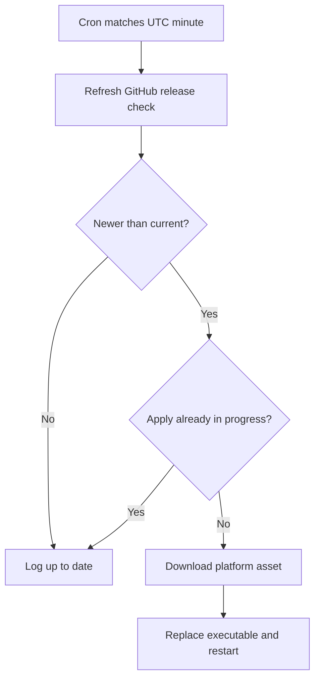

# Auto-Updates

Torrentarr can check [GitHub Releases](https://github.com/Feramance/Torrentarr/releases) for newer versions and, when enabled, **download and apply** a matching **self-contained binary** for the current OS/architecture. Docker deployments should normally be updated by **refreshing the image** (Watchtower, `docker pull`, etc.), not by relying on in-container binary replacement.

---

## Overview

When auto-update runs it:

1. **Checks** the GitHub API for the latest release (cached for about one hour unless forced).
2. **Compares** the published version to the running build.
3. **Applies** an update by downloading the release asset, replacing the running executable, and restarting the process (same mechanism as **Install update** in the WebUI).

`GET /web/meta` (and `GET /api/meta`) report `installation_type` as `"binary"` and include `update_available`, `binary_download_url`, and apply state.

!!! note "What is supported"
    - **Native / binary installs:** Scheduled check + apply when `AutoUpdateEnabled = true`, or manual/WebUI **Install update**.
    - **Docker:** Prefer **Watchtower**, **compose pull**, or your orchestrator. In-container apply is fragile (layers reset on recreate); keep `AutoUpdateEnabled = false` unless you know you want it.
    - **Running from `dotnet run` / unpublished builds:** Treat updates as **manual** (pull latest, rebuild, or use a release binary).

---

## Configuration

Auto-updates are configured under `[Settings]` in `config.toml`:

```toml
[Settings]
# Enable the cron-driven update worker (Host only)
AutoUpdateEnabled = false

# Cron expression (UTC), 5 fields: minute hour day-of-month month day-of-week
AutoUpdateCron = "0 3 * * 0"
```

### `AutoUpdateEnabled`

**Type:** Boolean
**Default:** `false`

When `true`, the Host runs `AutoUpdateBackgroundService`: on each matching cron minute it refreshes the release check and, if a newer version is available and no apply is already running, starts the same apply path as **POST /web/update**.

### `AutoUpdateCron`

**Default:** `"0 3 * * 0"` (Sundays 03:00 UTC)

Examples:

```toml
AutoUpdateCron = "0 3 * * *"    # daily 03:00 UTC
AutoUpdateCron = "0 3 * * 0,3"  # Sun and Wed 03:00 UTC
AutoUpdateCron = "0 2 1 * *"    # 1st of month 02:00 UTC
```

---

## Manual updates

### WebUI

1. Open **Settings** → **Updates** (or your build’s updates screen).
2. **Check for updates** (loads `GET /web/meta`, optionally with force refresh).
3. If an update is available, use **Install update** (calls `POST /web/update`).

### API (Host)

Check meta (includes `update_available`, `latest_version`, `binary_download_url` when resolved):

```bash
curl -s "http://localhost:6969/api/meta?force=1" \
  -H "Authorization: Bearer YOUR_TOKEN"
```

Start apply (downloads asset and replaces executable; process restarts):

```bash
curl -s -X POST "http://localhost:6969/api/update" \
  -H "Authorization: Bearer YOUR_TOKEN"
```

Download info only:

```bash
curl -s "http://localhost:6969/api/download-update" \
  -H "Authorization: Bearer YOUR_TOKEN"
```

---

## Flow (scheduled)



---

## Docker

Recommended:

- Set **`AutoUpdateEnabled = false`** in container config.
- Update with **`docker pull feramance/torrentarr:tag`** and recreate the container, or use **Watchtower** / similar.

If you enable internal auto-update inside a container, the filesystem may still be ephemeral; the **image tag** you deploy should remain the source of truth for production.

---

## Troubleshooting

### Invalid cron

Fix `AutoUpdateCron` to five fields with valid ranges (hour 0–23, etc.). Invalid expressions are rejected and auto-update stays off.

### Apply fails (permissions / disk)

Ensure the process user can write to the executable directory and temp space for the download. Check Host logs and `update_state` on `GET /web/meta`.

### No binary for this platform

Release assets follow CI naming (e.g. `linux-x64`, `linux-arm64`, `osx-x64`, `osx-arm64`, `win-x64`). If no asset matches, use **Docker** or **build from source**.

---

## FFprobe auto-update

Torrentarr can download **FFprobe** for media checks (separate from application updates).

```toml
[Settings]
FFprobeAutoUpdate = true
```

When enabled, FFprobe may be fetched (e.g. via ffbinaries) if missing. Paths follow your config directory layout; see [Health monitoring](health-monitoring.md).

---

## Security

- Application updates use **GitHub Releases** for the `Feramance/Torrentarr` repository.
- Outbound HTTPS to `github.com` is required for version checks and downloads.
- Optional: set `GITHUB_TOKEN` if you hit unauthenticated API rate limits.

---

## Best practices

- **Production:** Prefer pinned Docker tags or tested binaries; enable cron apply only if you accept automatic restarts.
- **After updates:** Confirm version in the WebUI and that workers reconnect.
- **Back up** `config.toml` and `torrentarr.db` before first enable.

---

## Related

- [WebUI API reference](../webui/api.md) — `/web/meta`, `/web/update`
- [WebUI configuration](../configuration/webui.md)
- [Binary installation](../getting-started/installation/binary.md)

---

## Summary

- **Binary / native Host:** GitHub release check + optional **cron apply** and **WebUI/API apply**.
- **Docker:** Update the **image** with your platform workflow; internal auto-update is optional and often disabled.
- **From source:** Update by rebuilding or switching to a release binary.
