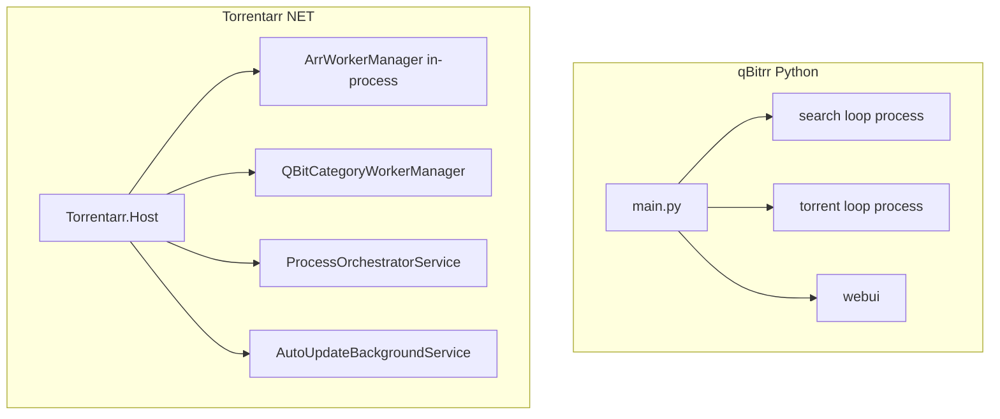
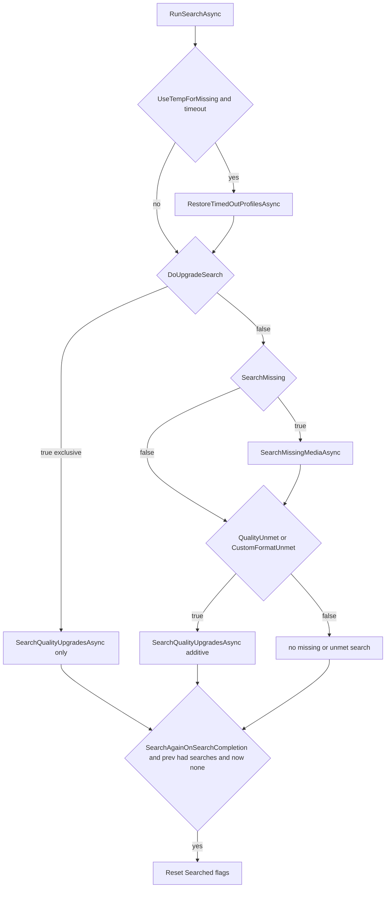

# Full qBitrr → Torrentarr parity path report

End-to-end review of **every user-facing feature and logical path**, compared to upstream [qBitrr](https://github.com/Feramance/qBitrr).

| Field | Value |
| --- | --- |
| **qBitrr baseline** | v5.14.3-1 / current `master` (`EXPECTED_CONFIG_VERSION = 5.14.3`) |
| **Torrentarr** | product 6.14.3-1, schema **6.14.3** (+1 major) |
| **Contracts** | same `config.toml` format; same logical SQLite schema; DB file is `torrentarr.db` |
| **Row-level file map** | [full-parity-matrix.md](full-parity-matrix.md) |
| **Contributor pin / tests** | [contributor-reference.md](contributor-reference.md) |
| **User overview** | [overview.md](overview.md) |

Legend:

- **Match** — same user-facing outcome as qBitrr
- **Arch** — differs because of .NET Host / in-process workers; outcome is equivalent by design
- **Drift** — Torrentarr behavior or docs disagree with qBitrr
- **Gap** — code missing, unused, or not wired on the production Host path

This report does **not** change runtime behavior. Follow-up work to close real drift is listed in [§10](#10-follow-up-work-not-done-in-this-review).

---

## Matrix vs current upstream layout

[full-parity-matrix.md](full-parity-matrix.md) still maps a **monolithic** `qBitrr/arss.py`. Upstream has split that into `qBitrr/arss/`:

- `arr_base.py` (~164KB) — shared Arr manager, loops, torrent processing
- `torrent_dispatch.py`, `torrent_inspect.py`, `torrent_limits.py`, `torrent_batch.py`, `torrent_policy.py`
- `search_handlers.py`, `db_update_handlers.py`, `db_queries.py`
- `request_providers.py`, `placeholder_arr.py`
- type modules: `radarr.py`, `sonarr.py`, `lidarr.py`, `readarr.py`
- `manager.py`, `factory.py`, `qbit_side_effects.py`

qBitrr modules **absent from the matrix**:

- `config_reload_policy.py`
- `process_lifecycle.py`
- `quality_profile_helpers.py`
- `radarr_availability.py`
- `qbit_seeding_config.py`
- `arr_client.py`

Torrentarr counterparts exist in spirit (`ConfigReloader`, Host lifecycle, `QualityProfileSwitcherService`, `MinimumAvailabilityCheck`, `SeedingLimitMerge`, Arr HTTP clients) but are not row-tracked.

---

## 1. Process topology

| Area | Status | Notes |
| --- | --- | --- |
| OS forks (`pathos`) vs Host `BackgroundService` | **Arch** | Canonical loop: [`ArrWorkerManager.cs`](../../src/Torrentarr.Infrastructure/Services/ArrWorkerManager.cs). [`Torrentarr.Workers`](../../src/Torrentarr.Workers/Program.cs) exists but **Host does not spawn it**. |
| Processes UI rows `{name}-search` / `{name}-torrent` | **Match** | Same surface as qBitrr even though both are in-process tasks. |
| Docs saying “per-Arr worker processes” | **Drift** | [overview.md](overview.md), [features/process-management.md](../features/process-management.md). Code is in-process isolation. |
| `db_lock.py` | **Arch** | WAL + `SaveChangesWithRetryAsync` + `DatabaseRestartWatchdogService`. |
| Pathos dedicated-qBit-client gate / placeholder pause-resume queues (5.12.6 / 5.12.8) | **Arch** | Per-torrent `QBitInstanceName` routing; no default client. |

**Host orchestrator** ([`Program.cs`](../../src/Torrentarr.Host/Program.cs) `ProcessOrchestratorService`), each cycle:

1. Connect all qBit instances.
2. Special categories: delete `FailedCategory`, recheck `RecheckCategory` (age-gated by `Settings.IgnoreTorrentsYoungerThan`).
3. If SortTorrents or free space is enabled: `ProcessTorrentPolicyAsync` (tracker `topPrio` + pause/resume).
4. Sleep `LoopSleepTimer`.

---

## 2. Per-Arr worker loop (every feature gate)

Canonical path: `ArrWorkerManager.RunWorkerCoreAsync`.

### Startup (once)

1. Log search flags (`SearchMissing`, `DoUpgradeSearch`, `QualityUnmetSearch`, `CustomFormatUnmetSearch`).
2. Mark search/torrent process states alive.
3. `ProbeArrVersionAsync` (5s, non-blocking).
4. If `UseTempForMissing && ForceResetTempProfiles` → `QualityProfileSwitcherService.ForceResetAllTempProfilesAsync`.
5. `QBitCategoryEnsureService.EnsureCategoryOnAllInstancesAsync` + `SeedingService.EnsureAllTrackerTagsExistAsync`.

### Each iteration

| Step | Gate | Torrentarr | qBitrr |
| --- | --- | --- | --- |
| Connectivity | `PingURLS` fail | sleep `NoInternetSleepTimer`, skip cycle | same idea |
| Torrents | `!SearchOnly` | `TorrentProcessor.ProcessTorrentsAsync` + import-path cleanup | separate torrent loop |
| Sync | always | `ArrSyncService.SyncAsync` + `MarkRequestsAsync` + `UpdateCountsAsync` | `db_update` in search/torrent loops; huge Lidarr sync can `RestartLoopException` to unstarve search |
| RSS | `RssSyncTimer` (default 15 min if ≤0) | Arr `RssSync` command | same |
| Refresh downloads | `RefreshDownloadsTimer` | `RefreshMonitoredDownloads` | same |
| Search | `!ProcessingOnly` and `SearchRequestsEvery` elapsed | `RunSearchAsync` | **separate** search process, spawned when `SearchMissing` is true (qBitrr reverted independent spawn) |
| Backoff | error | `min(2×1.5^n, 30)` minutes | process restart limits |
| Sleep | remainder of `LoopSleepTimer` | combined loop | two loops |

**Drift:** Torrentarr has **no** `RestartLoopException` after huge `db_update`. Search always follows sync in the same iteration, gated only by `SearchRequestsEvery`. On giant Lidarr libraries, search is delayed by a full sync.

**Drift vs docs:** Torrentarr docs (copied from qBitrr) say **`SearchMissing` is the master switch** for all search, Overseerr, and Ombi. Code does **not** check it in `ShouldRunSearch`. `DoUpgradeSearch` / `QualityUnmetSearch` / `CustomFormatUnmetSearch` run even if `SearchMissing=false`. qBitrr `spawn_child_processes` requires `SearchMissing` after the revert of commit `7645b85`.

Restart limits (`AutoRestartProcesses`, `MaxProcessRestarts`, `ProcessRestartWindow`, `ProcessRestartDelay`) apply per Arr instance. **Match** with qBitrr process-restart policy, implemented as task restart rather than OS-process restart.

---

## 3. Search logical paths

Implementation: [`ArrWorkerManager.RunSearchAsync`](../../src/Torrentarr.Infrastructure/Services/ArrWorkerManager.cs), [`ArrMediaService`](../../src/Torrentarr.Infrastructure/Services/ArrMediaService.cs), [`SearchExecutor`](../../src/Torrentarr.Infrastructure/Services/SearchExecutor.cs).

### Missing-media candidates (`GetSearchCandidatesAsync`)

- Types: Radarr movies, Sonarr episodes, Lidarr albums, Readarr books.
- Filters: `ArrInstance` dictionary key, `Monitored` unless `Unmonitored`, `!HasFile`, `!Searched`.
- Skip specials if `!AlsoSearchSpecials` (Sonarr season 0).
- `PrioritizeTodaysReleases`: air/release in −25h / −1h window.
- Reason priority: Missing=1, CustomFormat=2, Quality=3, Upgrade=4, None/NotAvailable=99 (skipped).
- Availability: Radarr `MinimumAvailabilityCheck`; episodes/albums/books date windows.

### Upgrade candidates (`GetUpgradeCandidatesAsync`)

- Has file + monitored.
- `DoUpgradeSearch` → `!Upgrade` (sync resets `Upgrade=false`; search sets `Upgrade=true` via `MarkAsSearchedAsync`).
- Else → `!Searched`.
- When `DoUpgradeSearch`, `GetUpgradePriority` always returns Upgrade (searches **all** files). Otherwise only quality/CF unmet.

This matches qBitrr: `should_mark_searched` does **not** look at `do_upgrade_search`; upgrade loops use the Upgrade flag.

### Executor

- Sort: Priority, today’s release, Year ASC or DESC (`SearchInReverse`).
- Cap: `SearchLimit` vs active Arr commands (`queued` / `started` / `running` plus search command names).
- Delay: `SearchLoopDelay` if >0, else **30s**. Settings default is **-1**, so 30s unless a positive value is set.
- `UseTempForMissing` → switch to temp profile before search.
- Sonarr `SearchBySeries`: `"true"` / `"smart"` (count > 1) / `"false"`.
- Commands: MoviesSearch, EpisodeSearch, SeriesSearch, AlbumSearch, ArtistSearch, BookSearch, AuthorSearch.
- After trigger: `Searched=true` and `Upgrade=true`, scoped to `ArrInstance`.

### Requests (Ombi / Overseerr)

- `MarkRequestsAsync` only if `SearchOmbiRequests` / `SearchOverseerrRequests`.
- Radarr and Sonarr only (Lidarr/Readarr correctly skipped).
- Overseerr gates unreleased titles via TMDB (`OverseerrRequestFetcher`, qBitrr 5.12.12).
- Docs claim `SearchMissing` is required; code marks requests during **sync**, not during search.

### Temporary quality profiles

- Apply to **all four** Arr types in `QualityProfileSwitcherService`.
- [features/index.md](../features/index.md) wrongly says Lidarr-only (**Drift**).
- Restore only after a successful Arr PUT (**Match** with later Codex/qBitrr correctness).

### Stubs

- **Gap:** `ArrMediaService.IsQualityUpgradeAsync` always returns `false`.
- **Gap:** `ArrSyncService.CalculateLidarrQualityMet` always returns `true` and is unused.

**Drift — SearchAgainOnSearchCompletion:** Torrentarr infers loop end as “previous cycle had searches, this cycle has none.” qBitrr uses an explicit `loop_completed` after draining the candidate list.

---

## 4. Torrent state machine (every branch)

Source: [`TorrentProcessor.ProcessSingleTorrentAsync`](../../src/Torrentarr.Infrastructure/Services/TorrentProcessor.cs), annotated against qBitrr `_process_single_torrent`.

### Pre-steps (every torrent)

0. Tracker actions + seeding limits unless Host policy owns SortTorrents for that category.
1. `ResolveLeaveAloneAsync`: leave_alone / maxEta / removeTorrent; free-space-paused → leave alone; `qBitrr-allowed_seeding` tag.
2. Stalled check for MetaDL / StalledDL / Downloading: too young → ignore; within `StalledDelay` → `qBitrr-allowed_stalled`; else delete/re-search if `ReSearchStalled` (age: added **and** last_activity).
3. `qBitrr-ignored` → strip seeding/free-space tags, skip.

### Branches (first match wins)

1. Custom-format unmet (`CustomFormatUnmetSearch`) → delete if HnR allows.
2. `removeTorrent && !leaveAlone && AmountLeft==0` → delete (HnR).
3. Failed category → delete (no HnR).
4. Recheck category → recheck (Host also does this globally).
5. Missing files → delete from client, no blacklist.
6. Ignored qBit states → skip.
7. Stopped + leave_alone → resume.
8. Stalled DL/MetaDL + not stalled_ignore → stalled processor.
9. Downloading + not file-filtered → folder/name regex + `FileExtensionAllowlist`; `AutoDelete`.
10. Timed ignore cache → resume if stopped, else skip.
11. Queued upload → pause if `!leave_alone`.
12. Paused download with remaining data → resume.
13. Percentage threshold (`MaximumDeletablePercentage`, default 0.99) → protect near-complete.
14. Already scanned/imported → finalize when Arr queue is gone (`IsImportedAsync`, 5.12.7).
15. Error state → recheck.
16. Complete + 60s grace → import (`Downloaded*Scan`); leave_alone / ForcedUL → allow seeding instead.
17. Uploading + RemoveMode set → pause if `!leave_alone`.
18. Slow download: `0 < maxEta < Eta` and `!DoNotRemoveSlow` → delete (HnR); last_activity stale.
19. Downloading: availability-based delete or continue file processing.
20. Complete + leave_alone → resume seeding.
21. Default unprocessed.

### Import path

complete → 60s grace → `ArrImportService.TriggerImportAsync` → wait until the item leaves the Arr queue → `Imported=true` / `qbitrr-imported`. Multi-instance: client from `torrent.QBitInstanceName` only (no fallback). **Match** with 5.12.5–5.12.7.

### FFprobe

[`MediaValidationService`](../../src/Torrentarr.Infrastructure/Services/MediaValidationService.cs) implements ffprobe (ebook/comic suffix skip, optional auto-download via `FFprobeAutoUpdate`). It is **not** injected into `TorrentProcessor` and **not** registered in Host DI. Docs describe validate-then-import. **Gap:** FFprobe is dead code on the production Host path.

---

## 5. Seeding, HnR, trackers, free space

### SeedingService

- Per-qBit-instance `[qBit.CategorySeeding]` and `[qBit.Trackers]`; never cross-apply. **Match**
- Merge `-1` (unlimited) only if no source sets a positive limit (`SeedingLimitMerge`, qBitrr 5.14.2). **Match**
- `HitAndRunMode`: `and` / `or` / `disabled`. Progress below `HitAndRunMinimumDownloadPercent` → treat as safe; partial → `HitAndRunPartialSeedRatio`; dead-tracker message bypass (#412, not a bare `"not found"`). **Match**
- `RemoveMode` / `RemoveTorrent` -1/1/2/3/4 on uploading; HnR while downloading. **Match**
- Tracker inject/remove, tags, super-seed, `RemoveDeadTrackers` / `RemoveTrackerWithMessage`. **Match**
- Queue sort priority for `SortTorrents`. **Match** (live qBit still needed for full ordering proof)

### Free space (Host, all qBit instances)

- Disabled if `FreeSpace == "-1"`.
- Requires `AutoPauseResume`, folder exists, qBit configured.
- Gather torrents from **all** clients, sort globally by `AddedOn`, oldest first; pause/resume with `qBitrr-free_space_paused` (or Tagless DB column). **Match**

### qBit-only categories

`QBitCategoryWorkerManager` for `ManagedCategories` without Arr (qBitrr PlaceHolderArr / `placeholder_arr.py`). **Match**

---

## 6. Sync, catalog, database

[`ArrSyncService`](../../src/Torrentarr.Infrastructure/Services/ArrSyncService.cs) per Arr type: media upsert, queue sync, `ArrErrorCodesToBlocklist` scan, destructive-delete guards if the API returns empty against a large local set.

| Type | Identity / scores | Notes |
| --- | --- | --- |
| Movies | TMDB key; CF from movie file; `Upgrade=false` on update | **Match** |
| Episodes | wipe + reinsert per series; `Upgrade` defaults false | **Match** |
| Albums / tracks / artists | artists keyed by ArrId | **Match** |
| Books / authors | authors by ArrId; CF from first book file per book (`GetBookFilesByAuthorAsync`); empty files while stats claim files → treat missing | **Match** |

`DetermineSearched` = qBitrr `should_mark_searched` (has file and no active quality/CF search). Does **not** look at `DoUpgradeSearch`. **Match**

**Catalog identity:** UI category (`readarr-books`) vs section key (`Readarr-Books`) via `ArrCatalogIdentity.QueryKeys` (case-sensitive keys). **Match**

**Rollups:** `available = monitored AND has_file`, 5s TTL. **Match**

**Schema:** qBitrr lowercase table names; Readarr tables on new and existing DBs (`ManualSqliteMigrations`). **Match**

---

## 7. Config, auth, WebUI, packaging

**Config search order:** `TORRENTARR_CONFIG` → `./.config/config.toml` → `~/config/config.toml` → `~/.config/qbitrr/config.toml` → `~/.config/torrentarr/config.toml` → `./config.toml`. Env: `TORRENTARR_*` and `QBITRR_*`. **Match**

**Arr sections:** `Radarr-*` / `Sonarr-*` / `Lidarr-*` / `Readarr-*` with `.Torrent`, `.EntrySearch`, nested Ombi/Overseerr, `SkipTLSVerify`, `SearchOnly`, `ProcessingOnly`, `MatchSubcategories`, `ImportMode`, RSS/refresh timers. **Match**

**WebUI:** processes, logs, radarr, sonarr, lidarr, readarr, qbittorrent, config. Auth: token / local bcrypt / OIDC; first-run setup token. UrlBase + SPA reload. Empty-state loading; qBit groups collapsed. Dual `/web/*` and `/api/*`. OpenAPI drift vs qBitrr master in CI. **Match**

**Updates:** `AutoUpdateChannel` `latest` / `stable` / `nightly` (nightly is check-only; source builds never apply). Docker `:latest` / `:stable` (non-build) / `:nightly` (master) / `v*`. Weekly Dependabot squash + `release_type=build` **matches qBitrr** (Cursor Security finding is shared upstream behavior, not a Torrentarr-only hole).

**CLI:** `--version`, `--license`, `--source`, `--gen-config`, `--repair-database`, `--backup-database`. **Match** (table-scoped Python `repair_database_targeted.py` is not cloned; Host `--repair-database` is the operator path).

---

## 8. Feature × Arr coverage (actual code)

| Feature | Radarr | Sonarr | Lidarr | Readarr |
| --- | --- | --- | --- | --- |
| Health / stalled / slow / failed / recheck | yes | yes | yes | yes |
| Instant import (`Downloaded*Scan`) | yes | yes | yes | yes |
| Re-search / blocklist | yes | yes | yes | yes |
| Missing + upgrade + CF search | yes | yes | yes | yes |
| Temporary quality profiles | yes | yes | yes | yes |
| Overseerr / Ombi | yes | yes | no (correct) | no (correct) |
| `SearchBySeries` / today’s window | — | yes | — | — |
| Year sort (`SearchInReverse`) | yes | yes | yes | yes |
| `AlsoSearchSpecials` | — | yes | — | — |
| FFprobe before import | **not wired** | **not wired** | **not wired** | **not wired** |
| Catalog UI | movies | series | artists / albums | authors / books (no tracks) |
| Tagless free-space column | yes (global) | yes | yes | yes |
| qBit-only `ManagedCategories` | via Host `QBitCategoryWorkerManager` (all instances) | | | |

---

## 9. Honest gap list

The file matrix still marks these areas `full`. Path-level review disagrees:

1. **Gap — ffprobe:** service unused by Host / `TorrentProcessor`. User-facing “validate before import” is not live.
2. **Drift — SearchMissing master switch:** docs and qBitrr spawn require it; Torrentarr upgrade/CF search and request marking do not.
3. **Drift — combined worker loop:** no qBitrr-style search-loop reset after huge sync; Lidarr-sized libraries can delay search by a full sync.
4. **Drift — SearchAgainOnSearchCompletion:** Torrentarr infers loop end from consecutive cycles; qBitrr uses explicit `loop_completed`.
5. **Gap — Lidarr quality cutoff:** `CalculateLidarrQualityMet` is a no-op; Lidarr `QualityMet` is not computed from track cutoff the way movies/episodes/books are.
6. **Gap — `IsQualityUpgradeAsync`:** always false.
7. **Arch/docs — process model:** in-process vs OS processes; overview still says workers are processes.
8. **Matrix stale:** `arss.py` vs `qBitrr/arss/*`; missing upstream files in [§ Matrix vs current upstream layout](#matrix-vs-current-upstream-layout); contributor-reference vs matrix disagreement on `repair_database_targeted.py`.
9. **Doc drift:** [features/index.md](../features/index.md) omits Readarr; temp-profile row is wrong; [certification-report.md](certification-report.md) test counts are stale.
10. **Workers project:** standalone loop lacks Host sync/RSS/refresh; unused in production Host.

**Intentional (keep):** +1 major version, `torrentarr.db`, Serilog, Docker/.NET vs pip, no `db_lock`, no pathos, no placeholder queues, weekly-build matching qBitrr, OpenAPI generated from qBitrr.

---

## 10. Follow-up work (not done in this review)

Priority if the next change set is to close real drift:

1. Wire `IMediaValidationService` into import, or document it as unused.
2. Gate `ShouldRunSearch` / request processing on `SearchMissing`, **or** update Torrentarr docs if independent upgrade search is intended.
3. Compute Lidarr `QualityMet` from profile cutoff.
4. Refresh [full-parity-matrix.md](full-parity-matrix.md) to `qBitrr/arss/` and the extra Python modules.
5. Fix feature docs (Readarr, temp profiles, process model, certification test counts).
